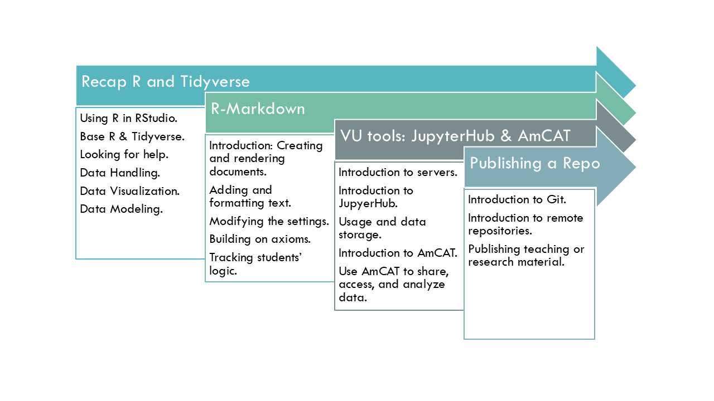

# R-course: Tools for teaching and research.

Welcome to the website of the R-course: Tools for teaching and research!

I designed this course to give social scientists all that is necessary to ease their teaching and research endeavors using R.

The course is designed for academics with a medium and advance level of R. It doesn't matter if you are a PhD student or a professor, you all are welcome!

Please keep in mind that all the material builds on itself. If you are interested on a specific topic, then you need to attend all the previous sessions: 

{#id .class width=50% height=50%}

## Requirements

Students need to:

* Bring their own laptops.
* Have R and Rstudio installed.
* Feel comfortable using the base R packages, as well as tidyverse.

## Do not forget to cite it
Did you find it useful? Then do not forget to cite it.

